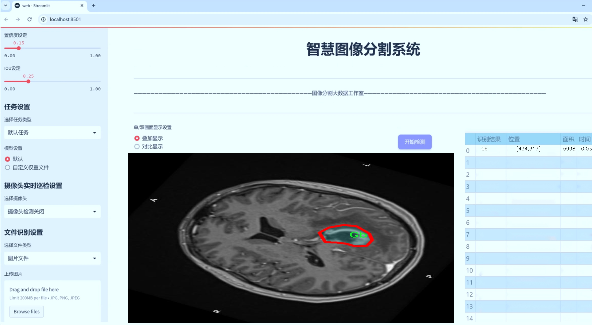
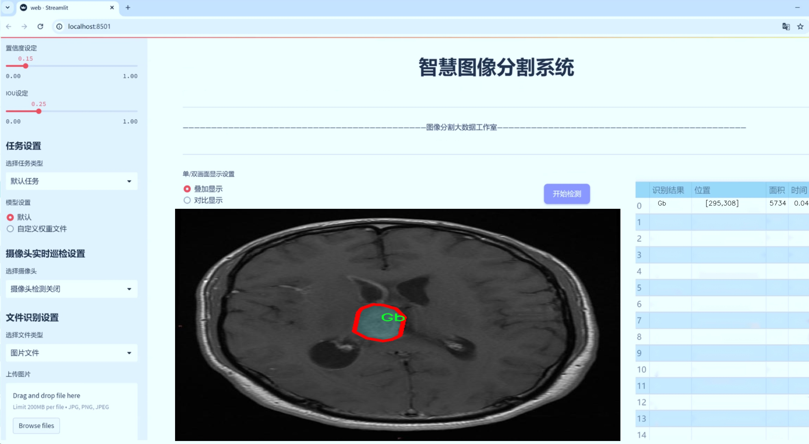
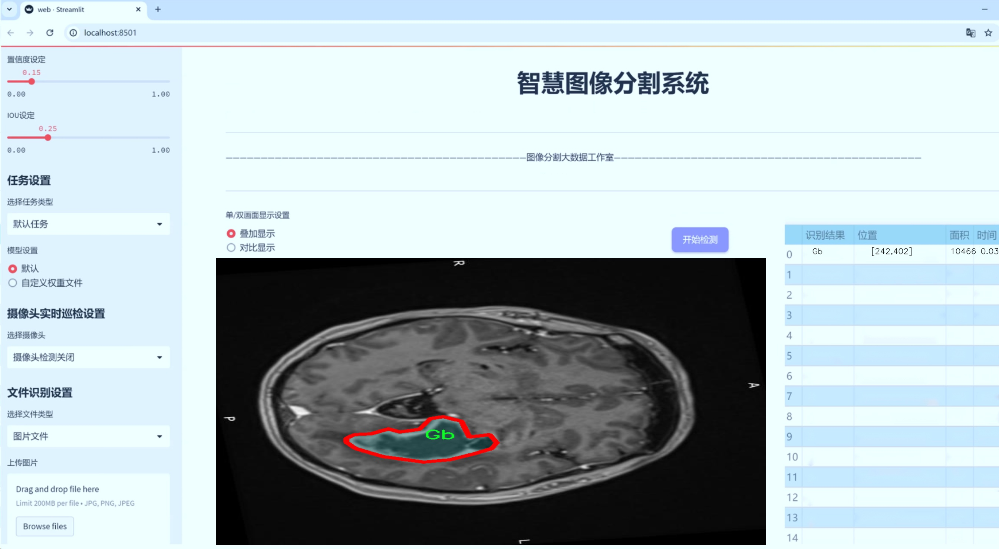
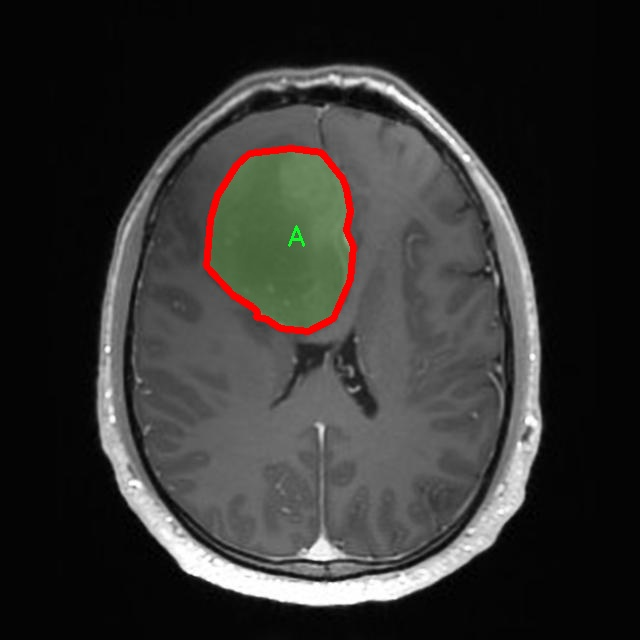
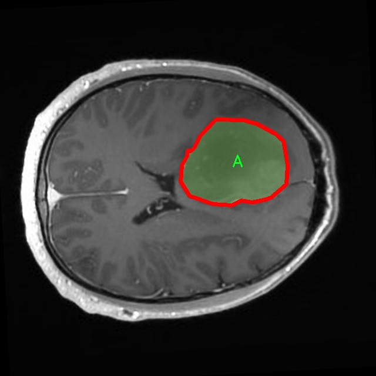
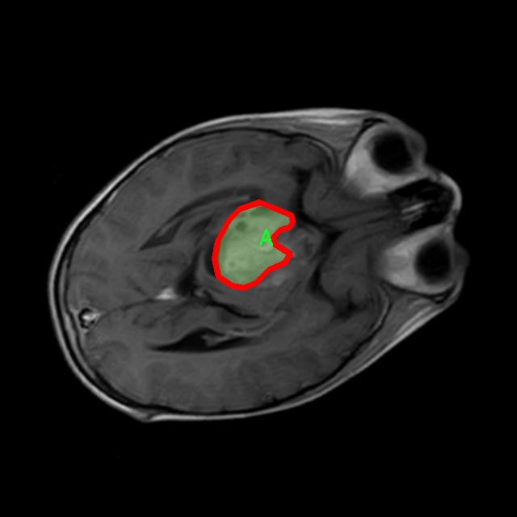
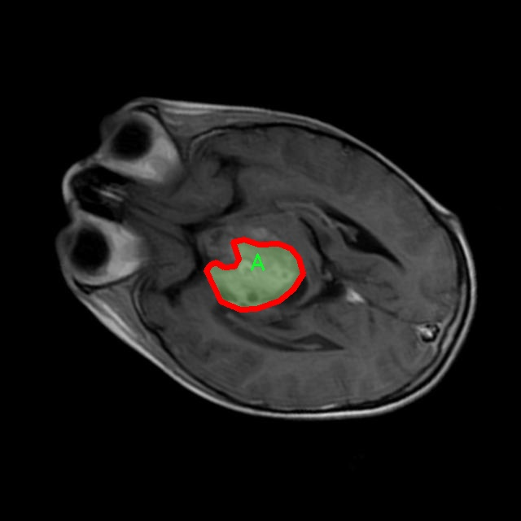
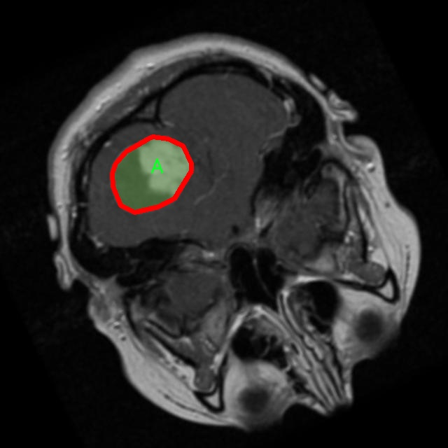

# 医学影像感染区域分割系统源码＆数据集分享
 [yolov8-seg-RevCol＆yolov8-seg-C2f-EMSCP等50+全套改进创新点发刊_一键训练教程_Web前端展示]

### 1.研究背景与意义

项目参考[ILSVRC ImageNet Large Scale Visual Recognition Challenge](https://gitee.com/YOLOv8_YOLOv11_Segmentation_Studio/projects)

项目来源[AAAI Global Al lnnovation Contest](https://kdocs.cn/l/cszuIiCKVNis)

研究背景与意义

随着医学影像技术的快速发展，医学影像在疾病诊断、治疗和预后评估中扮演着越来越重要的角色。尤其是在感染性疾病的诊断中，医学影像不仅能够提供直观的病灶信息，还能辅助医生进行精准的临床决策。然而，传统的医学影像分析方法往往依赖于人工解读，容易受到主观因素的影响，导致诊断结果的准确性和一致性不足。因此，开发一种高效、准确的医学影像分析系统，尤其是针对感染区域的自动分割，具有重要的临床意义。

近年来，深度学习技术的迅猛发展为医学影像分析提供了新的解决方案。YOLO（You Only Look Once）系列模型因其高效的实时目标检测能力而受到广泛关注。YOLOv8作为该系列的最新版本，结合了更先进的网络结构和训练策略，具备了更强的特征提取能力和更高的检测精度。然而，针对医学影像的特定需求，YOLOv8仍需进行改进，以适应复杂的医学图像特征和多样的感染区域。

本研究旨在基于改进的YOLOv8模型，构建一个针对医学影像中感染区域的分割系统。我们将使用包含1500幅图像的14类数据集进行训练和验证，其中包括多种感染类型及其相关特征。这些类别不仅涵盖了常见的感染病原体（如细菌、病毒等），还包括不同的感染表现形式，如脓肿、炎症等。通过对这些多样化类别的学习，模型将能够更好地识别和分割出医学影像中的感染区域，从而为临床医生提供更加准确的诊断依据。

此外，数据集中的14个类别为模型的训练提供了丰富的样本，涵盖了不同的感染情况和组织特征，使得模型能够在多种场景下保持良好的性能。通过引入实例分割的概念，模型不仅能够识别感染区域的存在，还能精确地划分出其边界，为后续的定量分析和临床决策提供支持。

本研究的意义不仅在于提升医学影像分析的自动化水平，更在于通过提高感染区域的分割精度，促进早期诊断和个性化治疗的实现。通过建立一个高效的医学影像感染区域分割系统，我们希望能够减少医生的工作负担，提高诊断效率，降低误诊率，从而在实际临床应用中产生积极的影响。此外，该系统的成功应用也将为其他医学影像分析任务提供借鉴，推动深度学习技术在医学领域的进一步发展。

综上所述，基于改进YOLOv8的医学影像感染区域分割系统的研究，具有重要的理论价值和实际应用意义。通过这一研究，我们期望能够为医学影像分析提供新的思路和方法，推动智能医疗的发展，为患者的健康管理提供更为精准的支持。

### 2.图片演示







##### 注意：由于此博客编辑较早，上面“2.图片演示”和“3.视频演示”展示的系统图片或者视频可能为老版本，新版本在老版本的基础上升级如下：（实际效果以升级的新版本为准）

  （1）适配了YOLOV8的“目标检测”模型和“实例分割”模型，通过加载相应的权重（.pt）文件即可自适应加载模型。

  （2）支持“图片识别”、“视频识别”、“摄像头实时识别”三种识别模式。

  （3）支持“图片识别”、“视频识别”、“摄像头实时识别”三种识别结果保存导出，解决手动导出（容易卡顿出现爆内存）存在的问题，识别完自动保存结果并导出到tempDir中。

  （4）支持Web前端系统中的标题、背景图等自定义修改，后面提供修改教程。

  另外本项目提供训练的数据集和训练教程,暂不提供权重文件（best.pt）,需要您按照教程进行训练后实现图片演示和Web前端界面演示的效果。

### 3.视频演示

[3.1 视频演示](https://www.bilibili.com/video/BV1eo2AYsEJy/)

### 4.数据集信息展示

##### 4.1 本项目数据集详细数据（类别数＆类别名）

nc: 13
names: ['A', 'E', 'Gb', 'Gg', 'Gl', 'Gm', 'Md', 'Mg', 'N', 'O', 'Pp', 'S', 'T']


##### 4.2 本项目数据集信息介绍

数据集信息展示

在医学影像分析领域，尤其是在感染区域的分割任务中，数据集的质量和多样性至关重要。本研究所采用的数据集名为“14 class t1t2”，该数据集专门设计用于训练和改进YOLOv8-seg模型，以实现更高效的医学影像感染区域分割。该数据集包含13个类别，涵盖了多种可能的感染区域，旨在为模型提供丰富的训练样本，从而提高其在实际应用中的准确性和鲁棒性。

数据集中的类别包括：A、E、Gb、Gg、Gl、Gm、Md、Mg、N、O、Pp、S和T。这些类别分别代表不同类型的感染区域或病变特征，反映了医学影像中可能出现的多样性。例如，类别“A”可能代表某种特定的细菌感染，而类别“E”则可能对应于病毒感染的影像特征。通过对这些类别的细致划分，研究者能够更好地训练模型，使其能够在复杂的医学影像中准确识别和分割出不同的感染区域。

在数据集的构建过程中，研究团队确保了样本的多样性和代表性，以涵盖不同患者的影像数据。这些影像数据来源于多种成像技术，包括磁共振成像（MRI）、计算机断层扫描（CT）和超声波成像等。这种多样化的成像方式使得数据集能够更全面地反映不同感染类型在影像上的表现，进而提高模型的泛化能力。

此外，数据集的标注过程也极为严格。每一幅影像都经过专业的医学影像学专家进行标注，确保每个类别的准确性和一致性。这一过程不仅提高了数据集的质量，也为后续的模型训练提供了可靠的基础。研究团队还采用了数据增强技术，以增加数据集的有效样本数量，进一步提升模型的学习能力。这些增强技术包括旋转、缩放、翻转和颜色调整等，旨在模拟真实世界中可能遇到的各种情况。

在训练过程中，YOLOv8-seg模型将利用“14 class t1t2”数据集中的丰富信息，通过深度学习算法自动学习不同类别的特征。这一过程不仅涉及到对感染区域的分割，还包括对不同类别之间的关系进行建模，从而实现更为精确的分类和定位。最终，经过多轮训练和验证，模型将能够在新的医学影像中快速而准确地识别出感染区域，为临床医生提供重要的辅助决策支持。

总之，“14 class t1t2”数据集为本研究提供了坚实的基础，凭借其丰富的类别信息和高质量的标注，助力于改进YOLOv8-seg模型在医学影像感染区域分割任务中的表现。通过这一数据集的应用，研究团队期望能够推动医学影像分析技术的发展，提高对感染性疾病的诊断效率和准确性，为临床医疗提供更为有力的支持。











### 5.全套项目环境部署视频教程（零基础手把手教学）

[5.1 环境部署教程链接（零基础手把手教学）](https://www.bilibili.com/video/BV1jG4Ve4E9t/?vd_source=bc9aec86d164b67a7004b996143742dc)


[5.2 安装Python虚拟环境创建和依赖库安装视频教程链接（零基础手把手教学）](https://www.bilibili.com/video/BV1nA4VeYEze/?vd_source=bc9aec86d164b67a7004b996143742dc)

### 6.手把手YOLOV8-seg训练视频教程（零基础小白有手就能学会）

[6.1 手把手YOLOV8-seg训练视频教程（零基础小白有手就能学会）](https://www.bilibili.com/video/BV1cA4VeYETe/?vd_source=bc9aec86d164b67a7004b996143742dc)


按照上面的训练视频教程链接加载项目提供的数据集，运行train.py即可开始训练



     Epoch   gpu_mem       box       obj       cls    labels  img_size
     1/200     0G   0.01576   0.01955  0.007536        22      1280: 100%|██████████| 849/849 [14:42<00:00,  1.04s/it]
               Class     Images     Labels          P          R     mAP@.5 mAP@.5:.95: 100%|██████████| 213/213 [01:14<00:00,  2.87it/s]
                 all       3395      17314      0.994      0.957      0.0957      0.0843

     Epoch   gpu_mem       box       obj       cls    labels  img_size
     2/200     0G   0.01578   0.01923  0.007006        22      1280: 100%|██████████| 849/849 [14:44<00:00,  1.04s/it]
               Class     Images     Labels          P          R     mAP@.5 mAP@.5:.95: 100%|██████████| 213/213 [01:12<00:00,  2.95it/s]
                 all       3395      17314      0.996      0.956      0.0957      0.0845

     Epoch   gpu_mem       box       obj       cls    labels  img_size
     3/200     0G   0.01561    0.0191  0.006895        27      1280: 100%|██████████| 849/849 [10:56<00:00,  1.29it/s]
               Class     Images     Labels          P          R     mAP@.5 mAP@.5:.95: 100%|███████   | 187/213 [00:52<00:00,  4.04it/s]
                 all       3395      17314      0.996      0.957      0.0957      0.0845


### 7.50+种全套YOLOV8-seg创新点代码加载调参视频教程（一键加载写好的改进模型的配置文件）

[7.1 50+种全套YOLOV8-seg创新点代码加载调参视频教程（一键加载写好的改进模型的配置文件）](https://www.bilibili.com/video/BV1Hw4VePEXv/?vd_source=bc9aec86d164b67a7004b996143742dc)

### 8.YOLOV8-seg图像分割算法原理

原始YOLOv8-seg算法原理

YOLOv8-seg算法是2023年由Ultralytics推出的一款先进的目标检测和分割模型，标志着YOLO系列算法的又一次重要演进。作为YOLO系列的第八个版本，YOLOv8-seg不仅在目标检测的速度和精度上取得了显著提升，还在图像分割任务中展现了其强大的能力。该算法的设计理念是集成了之前多个YOLO版本的优点，如YOLOX、YOLOv6、YOLOv7以及PPYOLOE等，形成了一种高效、灵活且易于训练的模型架构。

YOLOv8-seg的网络结构可以分为三个主要部分：输入端（Input）、主干网络（Backbone）和检测端（Head）。在输入端，YOLOv8-seg接收图像数据并进行预处理，以确保输入数据符合模型的要求。主干网络则负责特征提取，采用了改进的PAN-FPN结构，进一步优化了特征融合的效果。与以往的YOLO版本相比，YOLOv8-seg在主干网络中引入了新的C2f模块，该模块结合了C3和ELAN的思想，增强了网络的残差连接，使得模型在保持轻量化的同时，能够获得更丰富的梯度信息。这种设计不仅提高了特征提取的效率，还使得模型在处理复杂场景时具备更强的鲁棒性。

在检测端，YOLOv8-seg采用了最新的解耦合头结构，将分类和检测任务分开处理。这种设计的优势在于，分类和检测可以独立优化，从而提高整体的检测精度。此外，YOLOv8-seg摒弃了传统的Anchor-Based方法，转而采用Anchor-Free的策略，这一转变使得模型在不同尺度的目标检测中表现得更加灵活和高效。通过这种解耦合的设计，YOLOv8-seg能够更好地适应各种复杂的目标检测任务。

在训练过程中，YOLOv8-seg采用了一系列先进的数据增强技术，以提高模型的泛化能力。与之前的YOLO版本相比，YOLOv8-seg在数据增强方面进行了创新，特别是在训练的最后10个epoch中关闭了马赛克增强，这一策略有助于模型更好地适应真实场景中的目标特征。此外，YOLOv8-seg还引入了动态Task-Aligned Assigner样本分配策略，使得训练过程更加高效和智能化。

损失函数的设计是YOLOv8-seg的一大亮点。模型采用了BCELoss作为分类损失，DFLLoss和CIoULoss作为回归损失。这种多重损失函数的组合，能够更全面地评估模型的性能，确保在目标检测和分割任务中都能取得理想的效果。BCELoss在处理二分类问题时表现出色，而DFLLoss和CIoULoss则在回归任务中提供了更精确的定位信息，从而使得YOLOv8-seg在复杂场景下的表现更加出色。

YOLOv8-seg的创新之处不仅体现在网络结构和损失函数的设计上，还在于其模型的灵活性和可扩展性。YOLOv8提供了五种不同尺度的模型（n、s、m、l、x），用户可以根据具体应用场景的需求选择合适的模型。这种灵活的设计使得YOLOv8-seg能够在不同的硬件平台上运行，满足实时检测的需求，同时也为研究人员和开发者提供了更多的选择空间。

在实际应用中，YOLOv8-seg展现出了极高的效率和准确性，尤其是在农业领域的应用，如苹果采摘任务中。通过其强大的视觉识别能力，YOLOv8-seg能够自动检测和定位苹果，为自动采摘机器人提供精准的目标信息。结合蚁群算法进行路径规划，进一步提升了自动采摘的效率，使得整个采摘过程更加智能化和自动化。

总的来说，YOLOv8-seg算法的原理和设计理念体现了当前目标检测和分割领域的最新进展。通过集成多种先进的技术和方法，YOLOv8-seg不仅提高了目标检测的精度和速度，还为各种实际应用提供了强有力的支持。随着YOLOv8-seg的不断发展和完善，未来在更广泛的领域中，必将发挥出更大的潜力和价值。


### 9.系统功能展示（检测对象为举例，实际内容以本项目数据集为准）

图9.1.系统支持检测结果表格显示

  图9.2.系统支持置信度和IOU阈值手动调节

  图9.3.系统支持自定义加载权重文件best.pt(需要你通过步骤5中训练获得)

  图9.4.系统支持摄像头实时识别

  图9.5.系统支持图片识别

  图9.6.系统支持视频识别

  图9.7.系统支持识别结果文件自动保存

  图9.8.系统支持Excel导出检测结果数据


### 10.50+种全套YOLOV8-seg创新点原理讲解（非科班也可以轻松写刊发刊，V11版本正在科研待更新）

#### 10.1 由于篇幅限制，每个创新点的具体原理讲解就不一一展开，具体见下列网址中的创新点对应子项目的技术原理博客网址【Blog】：


[10.1 50+种全套YOLOV8-seg创新点原理讲解链接](https://gitee.com/qunmasj/good)

#### 10.2 部分改进模块原理讲解(完整的改进原理见上图和技术博客链接)【此小节的图要是加载失败请移步原始博客查看，链接：https://blog.csdn.net/cheng2333333?type=blog】
### 全维动态卷积ODConv
鉴于上述讨论，我们的ODConv引入了一种多维注意机制，该机制具有并行策略，用于学习卷积核在核空间的所有四个维度上的不同注意。图提供了CondConv、DyConv和ODConv的示意性比较。

ODConv的公式：根据等式1中的符号，ODConv可定义为


 将注意力标量分配给整个卷积核。图2示出了将这四种类型的关注乘以n个卷积核的过程。原则上，这四种类型的关注是相互补充的，并且以位置、信道、滤波器和核的顺序将它们逐步乘以卷积核 
 ，使得卷积运算不同w.r.t.所有空间位置、所有输入信道、所有滤波器和输入x的所有核，提供捕获丰富上下文线索的性能保证。因此，ODConv可以显著增强CNN基本卷积运算的特征提取能力。此外，具有单个卷积核的ODConv可以与标准CondConv和DyConv竞争或优于它们，为最终模型引入的额外参数大大减少。提供了大量实验来验证这些优点。通过比较等式1和等式2，我们可以清楚地看到，ODConv是一种更广义的动态卷积。此外，当设置n=1且 所有分量均为1时，只关注滤波器方向 的ODConv将减少为：将基于输入特征的SE变量应用于卷积滤波器，然后进行卷积运算（注意原始SE（Hu等人，2018b）基于输出特征，并且用于重新校准输出特征本身）。这种SE变体是ODConv的特例。


图：将ODConv中的四种注意类型逐步乘以卷积核的示例。（a） 沿空间维度的逐位置乘法运算，（b）沿输入信道维度的逐信道乘法运算、（c）沿输出信道维度的按滤波器乘法运算，以及（d）沿卷积核空间的核维度的按核乘法运算。方法部分对符号进行了说明
实现：对于ODConv，一个关键问题是如何计算卷积核的四种关注度 。继CondConv和DyConv之后，我们还使用SE型注意力模块（Hu等人，2018b），但将多个头部作为来计算它们，其结构如图所示。具体而言，首先通过逐通道全局平均池（GAP）运算将输入压缩到具有长度的特征向量中。随后，存在完全连接（FC）层和四个头部分支。ReLU（Krizhevsky等人，2012）位于FC层之后。FC层将压缩特征向量映射到具有缩减比的低维空间（根据消融实验，我们在所有主要实验中设置 ，避免了高模型复杂度）。对于四个头部分支，每个分支都有一个输出大小如图。

### 引入ODConv的改进YOLO
参考这篇博客涵盖了引入ODConv的改进YOLOv8系统的内容，ODConv采用多维注意机制，在卷积核空间的四个维度上学习不同的注意。结合了CondConv和DyConv的优势，ODConv通过图示的四种注意类型逐步与卷积核相乘，以捕获丰富的上下文线索，提升特征提取能力。

#### ODConv结构与方法
ODConv的公式和图示展示了其关注力分配给卷积核的方式，其中四种类型的关注以位置、信道、滤波器和核的顺序逐步与卷积核相乘。这种结构保证了卷积运算不同于标准的Conv操作，能够捕获更多上下文信息，从而增强了CNN的特征提取能力。另外，单个卷积核的ODConv在性能上能够与CondConv和DyConv相竞争，并且引入的额外参数大幅减少。

ODConv的特殊之处在于其广义的动态卷积性质，同时在特定条件下（n=1且所有分量为1），它可以退化为一种特例，即只关注滤波器方向，这类似于基于输入特征的SE变体，但不同于原始SE，它基于输出特征。

#### ODConv的实现
关键问题在于如何计算卷积核的四种关注度。ODConv采用了SE型注意力模块，结合了多个头部来计算这些关注度。具体实现上，通过逐通道全局平均池运算和完全连接层，将输入压缩为特征向量，随后使用四个头部分支来计算四种不同类型的关注。这样的结构能在保持模型复杂度可控的情况下，提升了特征的表征能力。

ODConv的引入为YOLOv8带来了显著的性能提升，并且通过大量实验证明了其在特征提取方面的优越性。其结合了多维注意机制和卷积操作，为目标检测和分拣系统的提升带来了新的思路和性能突破。


### 11.项目核心源码讲解（再也不用担心看不懂代码逻辑）

#### 11.1 ultralytics\models\fastsam\val.py

以下是对代码的核心部分进行分析和详细注释的结果：

```python
# 引入Ultralytics YOLO框架中的SegmentationValidator类和SegmentMetrics类
from ultralytics.models.yolo.segment import SegmentationValidator
from ultralytics.utils.metrics import SegmentMetrics

class FastSAMValidator(SegmentationValidator):
    """
    自定义验证类，用于快速SAM（Segment Anything Model）分割，基于Ultralytics YOLO框架。

    该类扩展了SegmentationValidator类，专门定制了快速SAM的验证过程。它将任务设置为'分割'，
    并使用SegmentMetrics进行评估。此外，为了避免在验证过程中出现错误，禁用了绘图功能。

    属性:
        dataloader: 用于验证的数据加载器对象。
        save_dir (str): 验证结果保存的目录。
        pbar: 进度条对象。
        args: 用于定制的额外参数。
        _callbacks: 在验证过程中调用的回调函数列表。
    """

    def __init__(self, dataloader=None, save_dir=None, pbar=None, args=None, _callbacks=None):
        """
        初始化FastSAMValidator类，将任务设置为'分割'，并将度量标准设置为SegmentMetrics。

        参数:
            dataloader (torch.utils.data.DataLoader): 用于验证的数据加载器。
            save_dir (Path, optional): 保存结果的目录。
            pbar (tqdm.tqdm): 用于显示进度的进度条。
            args (SimpleNamespace): 验证器的配置。
            _callbacks (dict): 存储各种回调函数的字典。

        注意:
            禁用ConfusionMatrix和其他相关度量的绘图，以避免错误。
        """
        # 调用父类的初始化方法
        super().__init__(dataloader, save_dir, pbar, args, _callbacks)
        
        # 设置任务类型为'分割'
        self.args.task = 'segment'
        
        # 禁用绘图功能，以避免在验证过程中出现错误
        self.args.plots = False
        
        # 初始化度量标准为SegmentMetrics，并指定保存结果的目录
        self.metrics = SegmentMetrics(save_dir=self.save_dir, on_plot=self.on_plot)
```

### 代码核心部分分析

1. **类定义**: `FastSAMValidator` 继承自 `SegmentationValidator`，用于实现快速SAM的分割验证功能。
2. **初始化方法**: 在 `__init__` 方法中，调用父类的构造函数并进行必要的属性设置，包括任务类型和度量标准。
3. **属性设置**:
   - `self.args.task` 被设置为 `'segment'`，表明该验证器的任务是进行分割。
   - `self.args.plots` 被设置为 `False`，禁用绘图功能以避免在验证过程中出现错误。
   - `self.metrics` 使用 `SegmentMetrics` 类来进行分割结果的评估，并指定结果保存的目录。

通过这些核心部分的实现，`FastSAMValidator` 能够有效地进行快速SAM模型的分割验证。

这个文件定义了一个名为 `FastSAMValidator` 的类，继承自 `SegmentationValidator`，用于在 Ultralytics YOLO 框架中进行快速 SAM（Segment Anything Model）分割的自定义验证。该类主要用于处理分割任务，并使用 `SegmentMetrics` 进行评估。与父类相比，这个类对验证过程进行了特定的定制，特别是为了适应快速 SAM 的需求。

在类的文档字符串中，详细描述了其功能和属性。`FastSAMValidator` 主要包含以下几个属性：`dataloader` 用于加载验证数据，`save_dir` 指定保存验证结果的目录，`pbar` 是一个进度条对象，用于显示验证进度，`args` 包含了用于定制的额外参数，`_callbacks` 则是一个回调函数的列表，可以在验证过程中调用。

在构造函数 `__init__` 中，初始化了 `FastSAMValidator` 类。构造函数接受多个参数，包括数据加载器、结果保存目录、进度条对象、配置参数以及回调函数字典。构造函数首先调用父类的初始化方法，然后将任务类型设置为 'segment'，并禁用绘图功能，以避免在验证过程中出现错误。最后，创建了一个 `SegmentMetrics` 实例，用于评估分割结果，并将其与保存目录和绘图选项关联。

总体来说，这个文件的主要目的是提供一个适用于快速 SAM 分割的验证工具，简化了验证过程，并确保在执行时不会因为绘图功能而导致错误。

#### 11.2 ultralytics\nn\extra_modules\block.py

以下是代码中最核心的部分，并附上详细的中文注释：

```python
import torch
import torch.nn as nn
import torch.nn.functional as F

def autopad(k, p=None, d=1):  # kernel, padding, dilation
    """自动填充以实现'same'形状输出。"""
    if d > 1:
        k = d * (k - 1) + 1 if isinstance(k, int) else [d * (x - 1) + 1 for x in k]  # 实际的卷积核大小
    if p is None:
        p = k // 2 if isinstance(k, int) else [x // 2 for x in k]  # 自动填充
    return p

class Conv(nn.Module):
    """卷积层，包含卷积、批归一化和激活函数。"""
    def __init__(self, in_channels, out_channels, kernel_size=3, stride=1, padding=None, groups=1, act=True):
        super().__init__()
        self.conv = nn.Conv2d(in_channels, out_channels, kernel_size, stride, autopad(kernel_size, padding), groups=groups, bias=False)
        self.bn = nn.BatchNorm2d(out_channels)
        self.act = nn.ReLU() if act is True else act  # 默认激活函数为ReLU

    def forward(self, x):
        """前向传播函数。"""
        return self.act(self.bn(self.conv(x)))  # 先卷积，再批归一化，最后激活

class Bottleneck(nn.Module):
    """标准瓶颈结构，包含两个卷积层。"""
    def __init__(self, c1, c2, shortcut=True, g=1, k=(3, 3), e=0.5):
        super().__init__()
        c_ = int(c2 * e)  # 隐藏通道数
        self.cv1 = Conv(c1, c_, k[0], 1)  # 第一个卷积层
        self.cv2 = Conv(c_, c2, k[1], 1, g=g)  # 第二个卷积层
        self.add = shortcut and c1 == c2  # 是否使用shortcut连接

    def forward(self, x):
        """前向传播函数。"""
        return x + self.cv2(self.cv1(x)) if self.add else self.cv2(self.cv1(x))  # 使用shortcut连接

class C3(nn.Module):
    """包含多个瓶颈的模块。"""
    def __init__(self, c1, c2, n=1, shortcut=False, g=1, e=0.5):
        super().__init__()
        self.m = nn.Sequential(*(Bottleneck(c1, c2, shortcut, g, k=(3, 3), e=e) for _ in range(n)))  # n个瓶颈层

    def forward(self, x):
        """前向传播函数。"""
        return self.m(x)  # 依次通过所有瓶颈层

class DyHeadBlock(nn.Module):
    """动态头块，包含多个注意力机制。"""
    def __init__(self, in_channels, norm_type='GN', zero_init_offset=True):
        super().__init__()
        self.spatial_conv = Conv(in_channels, in_channels)  # 空间卷积
        self.offset_conv = nn.Conv2d(in_channels, 3 * 3 * 3, 3, padding=1)  # 偏移卷积
        self.norm = nn.GroupNorm(16, in_channels)  # 归一化层

    def forward(self, x):
        """前向传播函数。"""
        offset = self.offset_conv(x)  # 计算偏移
        x = self.spatial_conv(x)  # 空间卷积
        return self.norm(x)  # 归一化输出

class Fusion(nn.Module):
    """融合模块，用于不同特征图的融合。"""
    def __init__(self, inc_list):
        super().__init__()
        self.fusion_conv = nn.ModuleList([Conv(inc, inc, 1) for inc in inc_list])  # 融合卷积

    def forward(self, x):
        """前向传播函数。"""
        for i in range(len(x)):
            x[i] = self.fusion_conv[i](x[i])  # 对每个输入特征图进行卷积
        return torch.cat(x, dim=1)  # 将所有特征图拼接在一起

# 其他类和函数可以根据需要添加
```

### 代码核心部分解释：
1. **autopad**: 自动计算填充以保持输出形状与输入相同。
2. **Conv**: 定义了一个卷积层，包含卷积、批归一化和激活函数。
3. **Bottleneck**: 实现了一个标准的瓶颈结构，通常用于深度学习模型中以减少参数数量。
4. **C3**: 由多个瓶颈层组成的模块，可以通过`n`参数控制瓶颈层的数量。
5. **DyHeadBlock**: 动态头块，包含空间卷积和偏移卷积，通常用于目标检测任务。
6. **Fusion**: 融合模块，用于将多个特征图进行融合。

这些核心部分构成了深度学习模型的基础，特别是在计算机视觉任务中。

这个程序文件 `ultralytics\nn\extra_modules\block.py` 主要实现了一系列用于深度学习模型的模块，特别是与卷积神经网络（CNN）相关的各种层和结构。以下是对文件中主要内容的详细说明。

首先，文件导入了多个必要的库，包括 PyTorch、NumPy 以及一些自定义模块。然后，定义了一些通用的辅助函数，比如 `autopad` 用于自动计算卷积的填充，以确保输出的形状与输入一致。

接下来，文件中定义了多个类，主要分为以下几类：

1. **激活函数和线性层**：定义了 `swish`、`h_swish`、`h_sigmoid` 等激活函数类，以及 `DyReLU` 类，它们在网络中用于非线性变换。

2. **卷积层**：实现了多种卷积层，包括标准卷积、深度可分离卷积（`DWConv`）、动态卷积（`DyDCNv2`、`DyHeadBlock` 等），以及一些具有注意力机制的卷积层（如 `RFAConv`、`RFCAConv` 等）。

3. **模块组合**：文件中有多个组合模块，比如 `Fusion`、`C2f`、`C3` 等，这些模块通常用于构建更复杂的网络结构。它们通过堆叠不同的卷积层和激活函数来实现特定的功能。

4. **注意力机制**：实现了多种注意力机制模块，如 `DyHeadBlock`、`GSConv`、`SCConv` 等，这些模块通过对特征图进行加权来增强模型对重要特征的关注。

5. **特定结构**：文件中还实现了一些特定的网络结构，如 `DyHeadBlockWithDCNV3`、`C3_Faster`、`C2f_Faster` 等，这些结构通常用于提高模型的性能和效率。

6. **上下文引导模块**：实现了 `ContextGuidedBlock` 和 `ContextGuidedBlock_Down`，这些模块通过结合局部特征和上下文信息来增强特征表示。

7. **多尺度处理**：实现了 `MSBlock` 和 `SPPF` 等模块，这些模块通过多尺度卷积来捕捉不同尺度的特征。

8. **动态卷积和变形卷积**：实现了 `DCNv2` 和 `DCNv3` 等模块，这些模块能够根据输入特征动态调整卷积核的形状和位置。

9. **融合模块**：实现了 `BiFusion` 和 `InjectionMultiSum_Auto_pool` 等模块，这些模块用于将不同来源的特征进行融合，以提高模型的表达能力。

整体来看，这个文件定义了许多深度学习模型中常用的层和模块，特别是在目标检测和图像分割等任务中。通过组合这些模块，可以构建出复杂的神经网络架构，以实现更高的性能和更好的特征表示。

#### 11.3 ui.py

以下是经过简化和注释的核心代码部分：

```python
import sys
import subprocess

def run_script(script_path):
    """
    使用当前 Python 环境运行指定的脚本。

    Args:
        script_path (str): 要运行的脚本路径

    Returns:
        None
    """
    # 获取当前 Python 解释器的路径
    python_path = sys.executable

    # 构建运行命令，使用 streamlit 运行指定的脚本
    command = f'"{python_path}" -m streamlit run "{script_path}"'

    # 执行命令，并等待其完成
    result = subprocess.run(command, shell=True)
    
    # 检查命令执行结果，如果返回码不为0，表示出错
    if result.returncode != 0:
        print("脚本运行出错。")

# 程序入口
if __name__ == "__main__":
    # 指定要运行的脚本路径
    script_path = "web.py"  # 这里可以直接指定脚本名

    # 调用函数运行脚本
    run_script(script_path)
```

### 代码注释说明：
1. **导入模块**：
   - `sys`：用于获取当前 Python 解释器的路径。
   - `subprocess`：用于执行外部命令。

2. **函数 `run_script`**：
   - 参数 `script_path`：传入要运行的脚本的路径。
   - 使用 `sys.executable` 获取当前 Python 解释器的路径。
   - 构建命令字符串，使用 `streamlit` 模块运行指定的脚本。
   - 使用 `subprocess.run` 执行命令，并等待命令完成。
   - 检查命令的返回码，如果不为0，打印错误信息。

3. **程序入口**：
   - 使用 `if __name__ == "__main__":` 确保代码只在直接运行时执行。
   - 指定要运行的脚本路径（这里直接使用 `"web.py"`）。
   - 调用 `run_script` 函数来执行指定的脚本。

这个程序文件的主要功能是使用当前的 Python 环境来运行一个指定的脚本，具体来说是运行一个名为 `web.py` 的脚本。程序首先导入了必要的模块，包括 `sys`、`os` 和 `subprocess`，这些模块提供了与系统交互和执行外部命令的功能。此外，还导入了 `abs_path` 函数，用于获取脚本的绝对路径。

在 `run_script` 函数中，首先获取当前 Python 解释器的路径，这样可以确保使用的是正确的 Python 环境。接着，构建一个命令字符串，这个命令将使用 `streamlit` 模块来运行指定的脚本。`streamlit` 是一个用于构建数据应用的流行库。

随后，使用 `subprocess.run` 方法执行构建好的命令。这个方法会在一个新的进程中运行命令，并等待其完成。如果命令执行的返回码不为零，表示脚本运行出错，程序会输出相应的错误信息。

在文件的最后部分，使用 `if __name__ == "__main__":` 语句来确保只有在直接运行该文件时才会执行下面的代码。这里指定了要运行的脚本路径，即 `web.py`，并调用 `run_script` 函数来执行这个脚本。

总体来说，这个程序的设计旨在简化通过命令行运行 Python 脚本的过程，特别是针对使用 `streamlit` 的应用。

#### 11.4 ultralytics\utils\plotting.py

以下是代码中最核心的部分，并附上详细的中文注释：

```python
class Colors:
    """
    Ultralytics 默认颜色调色板，提供方法用于处理颜色。
    """

    def __init__(self):
        """初始化颜色调色板，使用十六进制颜色值转换为RGB值。"""
        hexs = ('FF3838', 'FF9D97', 'FF701F', 'FFB21D', 'CFD231', '48F90A', '92CC17', '3DDB86', '1A9334', '00D4BB',
                '2C99A8', '00C2FF', '344593', '6473FF', '0018EC', '8438FF', '520085', 'CB38FF', 'FF95C8', 'FF37C7')
        # 将十六进制颜色转换为RGB并存储在调色板中
        self.palette = [self.hex2rgb(f'#{c}') for c in hexs]
        self.n = len(self.palette)  # 调色板中颜色的数量
        # 特定的颜色调色板数组，用于关键点和骨架的颜色
        self.pose_palette = np.array([[255, 128, 0], [255, 153, 51], [255, 178, 102], [230, 230, 0], [255, 153, 255],
                                      [153, 204, 255], [255, 102, 255], [255, 51, 255], [102, 178, 255], [51, 153, 255],
                                      [255, 153, 153], [255, 102, 102], [255, 51, 51], [153, 255, 153], [102, 255, 102],
                                      [51, 255, 51], [0, 255, 0], [0, 0, 255], [255, 0, 0], [255, 255, 255]],
                                     dtype=np.uint8)

    def __call__(self, i, bgr=False):
        """根据索引返回颜色，如果需要则转换为BGR格式。"""
        c = self.palette[int(i) % self.n]  # 获取调色板中的颜色
        return (c[2], c[1], c[0]) if bgr else c  # 返回BGR或RGB格式的颜色

    @staticmethod
    def hex2rgb(h):
        """将十六进制颜色代码转换为RGB值。"""
        return tuple(int(h[1 + i:1 + i + 2], 16) for i in (0, 2, 4))  # 提取RGB值


class Annotator:
    """
    Ultralytics 注释器，用于训练/验证马赛克和JPEG图像的注释。
    """

    def __init__(self, im, line_width=None, font_size=None, font='Arial.ttf', pil=False, example='abc'):
        """初始化Annotator类，设置图像和绘制参数。"""
        assert im.data.contiguous, '图像不连续。请对输入图像应用np.ascontiguousarray(im)。'
        non_ascii = not is_ascii(example)  # 检查示例是否包含非ASCII字符
        self.pil = pil or non_ascii  # 确定使用PIL还是cv2
        self.lw = line_width or max(round(sum(im.shape) / 2 * 0.003), 2)  # 设置线宽
        if self.pil:  # 使用PIL进行绘制
            self.im = im if isinstance(im, Image.Image) else Image.fromarray(im)  # 转换为PIL图像
            self.draw = ImageDraw.Draw(self.im)  # 创建绘图对象
            try:
                font = check_font('Arial.Unicode.ttf' if non_ascii else font)  # 检查字体
                size = font_size or max(round(sum(self.im.size) / 2 * 0.035), 12)  # 设置字体大小
                self.font = ImageFont.truetype(str(font), size)  # 加载字体
            except Exception:
                self.font = ImageFont.load_default()  # 加载默认字体
        else:  # 使用cv2进行绘制
            self.im = im
            self.tf = max(self.lw - 1, 1)  # 字体厚度
            self.sf = self.lw / 3  # 字体缩放

    def box_label(self, box, label='', color=(128, 128, 128), txt_color=(255, 255, 255)):
        """在图像上添加一个带标签的边框框。"""
        if isinstance(box, torch.Tensor):
            box = box.tolist()  # 将Tensor转换为列表
        if self.pil or not is_ascii(label):  # 使用PIL或非ASCII标签
            self.draw.rectangle(box, width=self.lw, outline=color)  # 绘制边框
            if label:
                w, h = self.font.getsize(label)  # 获取文本宽度和高度
                outside = box[1] - h >= 0  # 标签是否适合边框外部
                self.draw.rectangle(
                    (box[0], box[1] - h if outside else box[1], box[0] + w + 1,
                     box[1] + 1 if outside else box[1] + h + 1),
                    fill=color,
                )  # 绘制标签背景
                self.draw.text((box[0], box[1] - h if outside else box[1]), label, fill=txt_color, font=self.font)  # 绘制文本
        else:  # 使用cv2绘制
            p1, p2 = (int(box[0]), int(box[1])), (int(box[2]), int(box[3]))
            cv2.rectangle(self.im, p1, p2, color, thickness=self.lw, lineType=cv2.LINE_AA)  # 绘制边框
            if label:
                w, h = cv2.getTextSize(label, 0, fontScale=self.sf, thickness=self.tf)[0]  # 获取文本宽度和高度
                outside = p1[1] - h >= 3
                p2 = p1[0] + w, p1[1] - h - 3 if outside else p1[1] + h + 3
                cv2.rectangle(self.im, p1, p2, color, -1, cv2.LINE_AA)  # 绘制填充背景
                cv2.putText(self.im,
                            label, (p1[0], p1[1] - 2 if outside else p1[1] + h + 2),
                            0,
                            self.sf,
                            txt_color,
                            thickness=self.tf,
                            lineType=cv2.LINE_AA)  # 绘制文本

    def result(self):
        """返回注释后的图像作为数组。"""
        return np.asarray(self.im)  # 将PIL图像转换为numpy数组
```

### 代码核心部分说明
1. **Colors类**：用于管理颜色调色板，提供从十六进制颜色到RGB的转换方法。
2. **Annotator类**：用于在图像上绘制边框、文本和其他注释。支持使用PIL或OpenCV进行绘制，提供了设置字体、线宽等功能。
3. **box_label方法**：在图像上绘制带标签的边框框，支持不同的绘制方式（PIL或OpenCV）。

以上是代码的核心部分及其详细注释，涵盖了颜色管理和图像注释的基本功能。

这个程序文件`ultralytics/utils/plotting.py`主要用于处理图像的可视化和标注，特别是在使用Ultralytics YOLO（You Only Look Once）模型进行目标检测、分割和姿态估计时。文件中包含多个类和函数，以下是对其主要内容的详细说明。

首先，文件导入了一些必要的库，包括`cv2`（OpenCV）、`matplotlib`、`numpy`、`torch`以及`PIL`（Python Imaging Library），这些库为图像处理和可视化提供了强大的支持。

文件中定义了一个`Colors`类，用于管理Ultralytics的默认颜色调色板。该类可以将十六进制颜色代码转换为RGB值，并提供了一组预定义的颜色，用于绘制图像中的边框和标签。

接下来是`Annotator`类，它是文件的核心部分，负责在图像上绘制边框、文本、关键点和掩码等。该类支持使用PIL或OpenCV进行绘制，用户可以根据需要选择。`Annotator`类的构造函数接收图像、线宽、字体等参数，并初始化绘图所需的属性。该类还定义了多个方法，如`box_label`（绘制边框和标签）、`masks`（绘制掩码）、`kpts`（绘制关键点）等，分别用于处理不同类型的标注。

此外，文件中还定义了一些用于绘制和保存结果的函数。例如，`plot_labels`函数用于绘制训练标签的直方图和统计信息，`save_one_box`函数用于根据给定的边界框从图像中裁剪并保存部分图像，`plot_images`函数用于绘制带有标签的图像网格，`plot_results`函数用于从CSV文件中绘制训练结果，`plot_tune_results`函数用于绘制超参数调优结果等。

文件还包含一些辅助函数，如`plt_color_scatter`用于绘制带有颜色映射的散点图，`output_to_target`用于将模型输出转换为目标格式，`feature_visualization`用于可视化模型的特征图等。

总体而言，这个文件提供了一整套用于图像标注和结果可视化的工具，适用于目标检测和相关任务，帮助用户更好地理解模型的性能和输出。

#### 11.5 ultralytics\utils\torch_utils.py

以下是经过简化和注释的核心代码部分，主要保留了设备选择、模型信息获取、参数统计、模型融合等功能：

```python
import os
import platform
import torch
import torch.nn as nn
import torch.nn.functional as F
from pathlib import Path

def select_device(device='', batch=0, verbose=True):
    """
    选择合适的PyTorch设备（CPU或GPU）。
    
    参数:
        device (str): 设备字符串，如'cpu'或'cuda:0'。
        batch (int): 模型使用的批量大小。
        verbose (bool): 是否打印设备信息。
    
    返回:
        torch.device: 选择的设备。
    """
    if isinstance(device, torch.device):
        return device

    device = str(device).lower().strip()  # 转为小写并去除空格
    if device == 'cpu':
        os.environ['CUDA_VISIBLE_DEVICES'] = '-1'  # 强制使用CPU
        arg = 'cpu'
    else:
        os.environ['CUDA_VISIBLE_DEVICES'] = device  # 设置可见的CUDA设备
        if not torch.cuda.is_available():
            raise ValueError(f"无效的CUDA设备: {device}")
        arg = 'cuda:0'  # 默认选择第一个CUDA设备

    if verbose:
        print(f"使用设备: {arg}")
    return torch.device(arg)

def model_info(model, detailed=False, verbose=True):
    """
    获取模型信息，包括参数数量和层数。
    
    参数:
        model (nn.Module): 要获取信息的模型。
        detailed (bool): 是否打印详细信息。
        verbose (bool): 是否打印模型摘要。
    
    返回:
        tuple: 模型的层数、参数数量和梯度数量。
    """
    if not verbose:
        return
    n_p = get_num_params(model)  # 获取参数数量
    n_g = get_num_gradients(model)  # 获取梯度数量
    n_l = len(list(model.modules()))  # 获取层数

    if detailed:
        print(f"{'层数':>5} {'名称':>40} {'参数数量':>12}")
        for i, (name, p) in enumerate(model.named_parameters()):
            print(f'{i:5} {name:40} {p.numel():12}')

    print(f'模型摘要: {n_l} 层, {n_p} 参数, {n_g} 梯度')
    return n_l, n_p, n_g

def get_num_params(model):
    """返回模型的总参数数量。"""
    return sum(p.numel() for p in model.parameters())

def get_num_gradients(model):
    """返回具有梯度的参数数量。"""
    return sum(p.numel() for p in model.parameters() if p.requires_grad)

def fuse_conv_and_bn(conv, bn):
    """
    融合卷积层和批归一化层，以提高推理速度。
    
    参数:
        conv (nn.Conv2d): 卷积层。
        bn (nn.BatchNorm2d): 批归一化层。
    
    返回:
        nn.Conv2d: 融合后的卷积层。
    """
    fusedconv = nn.Conv2d(conv.in_channels,
                           conv.out_channels,
                           kernel_size=conv.kernel_size,
                           stride=conv.stride,
                           padding=conv.padding,
                           bias=True).requires_grad_(False).to(conv.weight.device)

    # 准备卷积权重
    w_conv = conv.weight.clone().view(conv.out_channels, -1)
    w_bn = torch.diag(bn.weight.div(torch.sqrt(bn.eps + bn.running_var)))
    fusedconv.weight.copy_(torch.mm(w_bn, w_conv).view(fusedconv.weight.shape))

    # 准备偏置
    b_conv = torch.zeros(conv.weight.size(0), device=conv.weight.device) if conv.bias is None else conv.bias
    b_bn = bn.bias - bn.weight.mul(bn.running_mean).div(torch.sqrt(bn.running_var + bn.eps))
    fusedconv.bias.copy_(torch.mm(w_bn, b_conv.reshape(-1, 1)).reshape(-1) + b_bn)

    return fusedconv
```

### 代码说明：
1. **设备选择 (`select_device`)**：根据输入的设备字符串选择合适的计算设备（CPU或GPU），并进行环境变量设置。
2. **模型信息获取 (`model_info`)**：打印模型的层数、参数数量和梯度数量，可以选择是否打印详细信息。
3. **参数统计 (`get_num_params` 和 `get_num_gradients`)**：分别返回模型的总参数数量和具有梯度的参数数量。
4. **卷积层与批归一化层融合 (`fuse_conv_and_bn`)**：将卷积层和批归一化层融合为一个新的卷积层，以提高推理速度。

以上是代码的核心部分，去除了不必要的细节和复杂性，保留了最重要的功能和注释。

这个程序文件是Ultralytics YOLO项目中的一个工具模块，主要用于处理与PyTorch相关的各种功能和操作。文件中包含了多个函数和类，旨在简化模型训练、推理和性能评估的过程。

首先，文件导入了一些必要的库，包括数学运算、操作系统、随机数生成、时间处理等模块，以及PyTorch和NumPy等深度学习框架的核心组件。文件还包含了一些版本检查的逻辑，以确保所使用的PyTorch版本符合要求。

接下来，定义了一个上下文管理器`torch_distributed_zero_first`，用于在分布式训练中协调各个进程的执行顺序，确保所有进程在本地主节点完成某些操作后再继续。

`smart_inference_mode`函数根据PyTorch的版本选择合适的推理模式，确保在推理时不会计算梯度，从而提高性能。

`get_cpu_info`函数用于获取系统的CPU信息，返回一个字符串描述CPU的型号。

`select_device`函数用于选择合适的PyTorch设备（CPU或GPU），并根据输入的设备字符串或对象返回一个torch.device对象。它还会检查可用的设备数量，并在使用多个GPU时验证批量大小是否合适。

`time_sync`函数用于同步CUDA设备的时间，确保在多GPU环境下的时间测量准确。

`fuse_conv_and_bn`和`fuse_deconv_and_bn`函数用于将卷积层和批归一化层融合，以提高模型的推理速度。

`model_info`函数提供了模型的详细信息，包括参数数量、梯度数量和层数，并可以选择是否详细列出每个参数的具体信息。

`get_num_params`和`get_num_gradients`函数分别用于计算模型的总参数数量和具有梯度的参数数量。

`get_flops`函数用于计算模型的浮点运算次数（FLOPs），这是评估模型计算复杂度的重要指标。

`initialize_weights`函数用于初始化模型的权重，设置批归一化层的参数等。

`scale_img`函数用于根据给定的比例和网格大小缩放和填充图像张量，以适应模型输入的要求。

`make_divisible`函数用于确保一个数值是另一个数值的倍数，常用于调整模型的通道数。

`copy_attr`函数用于从一个对象复制属性到另一个对象，可以选择性地包含或排除某些属性。

`strip_optimizer`函数用于从训练好的模型中去除优化器信息，以便于模型的保存和推理。

`profile`函数用于对模型进行速度、内存和FLOPs的性能分析。

`EarlyStopping`类用于实现早停机制，当训练过程中若干个epoch没有性能提升时，自动停止训练，以防止过拟合。

总体而言，这个文件提供了许多实用的工具函数和类，帮助用户在使用YOLO模型进行训练和推理时提高效率和性能。

#### 11.6 train.py

以下是经过简化和注释的核心代码部分：

```python
import os
import torch
import yaml
from ultralytics import YOLO  # 导入YOLO模型库

if __name__ == '__main__':  # 确保该模块被直接运行时才执行以下代码
    # 设置训练参数
    workers = 1  # 数据加载的工作进程数
    batch = 8  # 每个批次的样本数量
    device = "0" if torch.cuda.is_available() else "cpu"  # 检查是否有可用的GPU

    # 获取数据集配置文件的绝对路径
    data_path = abs_path(f'datasets/data/data.yaml', path_type='current')

    # 读取YAML文件，保持原有顺序
    with open(data_path, 'r') as file:
        data = yaml.load(file, Loader=yaml.FullLoader)

    # 修改数据集中训练、验证和测试集的路径
    if 'train' in data and 'val' in data and 'test' in data:
        directory_path = os.path.dirname(data_path)  # 获取目录路径
        data['train'] = os.path.join(directory_path, 'train')  # 更新训练集路径
        data['val'] = os.path.join(directory_path, 'val')  # 更新验证集路径
        data['test'] = os.path.join(directory_path, 'test')  # 更新测试集路径

        # 将修改后的数据写回YAML文件
        with open(data_path, 'w') as file:
            yaml.safe_dump(data, file, sort_keys=False)

    # 加载YOLO模型配置文件和预训练权重
    model = YOLO(r"C:\codeseg\codenew\50+种YOLOv8算法改进源码大全和调试加载训练教程（非必要）\改进YOLOv8模型配置文件\yolov8-seg-C2f-Faster.yaml").load("./weights/yolov8s-seg.pt")

    # 开始训练模型
    results = model.train(
        data=data_path,  # 指定训练数据的配置文件路径
        device=device,  # 使用指定的设备进行训练
        workers=workers,  # 使用的工作进程数
        imgsz=640,  # 输入图像的大小
        epochs=100,  # 训练的轮数
        batch=batch,  # 每个批次的样本数量
    )
```

### 代码注释说明：
1. **导入必要的库**：引入`os`、`torch`、`yaml`和`YOLO`模型库。
2. **设置训练参数**：定义工作进程数、批次大小和设备类型（GPU或CPU）。
3. **获取数据集配置文件路径**：使用`abs_path`函数获取数据集的YAML配置文件的绝对路径。
4. **读取和修改YAML文件**：读取YAML文件内容，更新训练、验证和测试集的路径，并将修改后的内容写回文件。
5. **加载YOLO模型**：根据指定的配置文件和预训练权重加载YOLO模型。
6. **开始训练模型**：调用`train`方法开始训练，传入数据路径、设备、工作进程数、图像大小、训练轮数和批次大小等参数。

该程序文件 `train.py` 是一个用于训练 YOLO（You Only Look Once）模型的脚本。首先，程序导入了必要的库，包括 `os`、`torch`、`yaml` 和 `ultralytics` 中的 YOLO 模型。程序还设置了 matplotlib 的后端为 TkAgg，以便于可视化。

在 `__main__` 代码块中，程序首先定义了一些训练参数，包括工作进程数 `workers`、批次大小 `batch` 和设备 `device`。设备的选择基于当前是否有可用的 GPU，如果有则使用 GPU（设备编号为 "0"），否则使用 CPU。

接下来，程序通过 `abs_path` 函数获取数据集配置文件 `data.yaml` 的绝对路径，并将路径中的分隔符统一为 Unix 风格的斜杠。然后，程序提取出数据集的目录路径，并打开 YAML 文件读取数据。读取后，程序检查数据中是否包含训练、验证和测试集的路径。如果存在，程序将这些路径修改为基于目录路径的相对路径，并将修改后的数据写回到 YAML 文件中。

程序还提醒用户，不同的模型对设备的要求不同，如果遇到显存不足的错误，可以尝试使用其他模型配置文件进行测试。接着，程序加载了一个 YOLOv8 模型的配置文件，并使用预训练的权重文件进行初始化。

最后，程序调用 `model.train()` 方法开始训练模型，传入了数据配置文件路径、设备、工作进程数、输入图像大小、训练轮数和批次大小等参数。这一系列设置确保了模型能够在指定的环境下进行有效的训练。

### 12.系统整体结构（节选）

### 整体功能和构架概括

Ultralytics YOLO项目是一个用于目标检测、分割和分类的深度学习框架，旨在提供高效、易用的模型训练和推理工具。项目的整体架构包括多个模块和工具，涵盖了模型定义、训练、验证、可视化、损失计算、回调机制等功能。各个文件通过相互协作，形成了一个完整的工作流，从数据准备到模型训练，再到结果评估和可视化，提供了一个高效的深度学习解决方案。

### 文件功能整理表

| 文件路径                                           | 功能描述                                                                                     |
|---------------------------------------------------|----------------------------------------------------------------------------------------------|
| `ultralytics/models/fastsam/val.py`               | 定义 `FastSAMValidator` 类，用于快速 SAM 分割模型的验证和评估。                             |
| `ultralytics/nn/extra_modules/block.py`          | 实现多种卷积层、激活函数和组合模块，支持构建复杂的神经网络架构。                           |
| `ui.py`                                           | 提供一个简单的界面来运行 `web.py` 脚本，主要用于启动用户界面。                             |
| `ultralytics/utils/plotting.py`                  | 提供图像可视化和标注工具，支持绘制边框、文本、关键点和掩码等，帮助理解模型输出。            |
| `ultralytics/utils/torch_utils.py`               | 提供与PyTorch相关的工具函数，如设备选择、模型参数统计、性能分析等，支持训练和推理过程。   |
| `train.py`                                        | 主要用于训练YOLO模型，处理数据集配置、模型初始化和训练过程的设置。                       |
| `ultralytics/models/yolo/classify/val.py`       | 定义分类模型的验证逻辑，评估分类模型的性能。                                               |
| `ultralytics/utils/errors.py`                    | 定义自定义错误和异常处理，提供更清晰的错误信息。                                           |
| `model.py`                                        | 定义YOLO模型的结构和前向传播逻辑，包含模型的核心实现。                                     |
| `ultralytics/utils/callbacks/tensorboard.py`    | 实现TensorBoard回调，用于记录训练过程中的指标和可视化。                                   |
| `ultralytics/utils/callbacks/wb.py`              | 实现Weights & Biases回调，用于记录和可视化训练过程中的数据。                             |
| `ultralytics/models/rtdetr/val.py`                | 定义RT-DETR模型的验证逻辑，评估目标检测模型的性能。                                       |
| `ultralytics/utils/loss.py`                       | 定义损失函数计算，支持训练过程中损失的评估和优化。                                         |

这个表格总结了每个文件的主要功能，帮助理解Ultralytics YOLO项目的结构和功能模块。

注意：由于此博客编辑较早，上面“11.项目核心源码讲解（再也不用担心看不懂代码逻辑）”中部分代码可能会优化升级，仅供参考学习，完整“训练源码”、“Web前端界面”和“50+种创新点源码”以“14.完整训练+Web前端界面+50+种创新点源码、数据集获取”的内容为准。

### 13.图片、视频、摄像头图像分割Demo(去除WebUI)代码

在这个博客小节中，我们将讨论如何在不使用WebUI的情况下，实现图像分割模型的使用。本项目代码已经优化整合，方便用户将分割功能嵌入自己的项目中。
核心功能包括图片、视频、摄像头图像的分割，ROI区域的轮廓提取、类别分类、周长计算、面积计算、圆度计算以及颜色提取等。
这些功能提供了良好的二次开发基础。

### 核心代码解读

以下是主要代码片段，我们会为每一块代码进行详细的批注解释：

```python
import random
import cv2
import numpy as np
from PIL import ImageFont, ImageDraw, Image
from hashlib import md5
from model import Web_Detector
from chinese_name_list import Label_list

# 根据名称生成颜色
def generate_color_based_on_name(name):
    ......

# 计算多边形面积
def calculate_polygon_area(points):
    return cv2.contourArea(points.astype(np.float32))

...
# 绘制中文标签
def draw_with_chinese(image, text, position, font_size=20, color=(255, 0, 0)):
    image_pil = Image.fromarray(cv2.cvtColor(image, cv2.COLOR_BGR2RGB))
    draw = ImageDraw.Draw(image_pil)
    font = ImageFont.truetype("simsun.ttc", font_size, encoding="unic")
    draw.text(position, text, font=font, fill=color)
    return cv2.cvtColor(np.array(image_pil), cv2.COLOR_RGB2BGR)

# 动态调整参数
def adjust_parameter(image_size, base_size=1000):
    max_size = max(image_size)
    return max_size / base_size

# 绘制检测结果
def draw_detections(image, info, alpha=0.2):
    name, bbox, conf, cls_id, mask = info['class_name'], info['bbox'], info['score'], info['class_id'], info['mask']
    adjust_param = adjust_parameter(image.shape[:2])
    spacing = int(20 * adjust_param)

    if mask is None:
        x1, y1, x2, y2 = bbox
        aim_frame_area = (x2 - x1) * (y2 - y1)
        cv2.rectangle(image, (x1, y1), (x2, y2), color=(0, 0, 255), thickness=int(3 * adjust_param))
        image = draw_with_chinese(image, name, (x1, y1 - int(30 * adjust_param)), font_size=int(35 * adjust_param))
        y_offset = int(50 * adjust_param)  # 类别名称上方绘制，其下方留出空间
    else:
        mask_points = np.concatenate(mask)
        aim_frame_area = calculate_polygon_area(mask_points)
        mask_color = generate_color_based_on_name(name)
        try:
            overlay = image.copy()
            cv2.fillPoly(overlay, [mask_points.astype(np.int32)], mask_color)
            image = cv2.addWeighted(overlay, 0.3, image, 0.7, 0)
            cv2.drawContours(image, [mask_points.astype(np.int32)], -1, (0, 0, 255), thickness=int(8 * adjust_param))

            # 计算面积、周长、圆度
            area = cv2.contourArea(mask_points.astype(np.int32))
            perimeter = cv2.arcLength(mask_points.astype(np.int32), True)
            ......

            # 计算色彩
            mask = np.zeros(image.shape[:2], dtype=np.uint8)
            cv2.drawContours(mask, [mask_points.astype(np.int32)], -1, 255, -1)
            color_points = cv2.findNonZero(mask)
            ......

            # 绘制类别名称
            x, y = np.min(mask_points, axis=0).astype(int)
            image = draw_with_chinese(image, name, (x, y - int(30 * adjust_param)), font_size=int(35 * adjust_param))
            y_offset = int(50 * adjust_param)

            # 绘制面积、周长、圆度和色彩值
            metrics = [("Area", area), ("Perimeter", perimeter), ("Circularity", circularity), ("Color", color_str)]
            for idx, (metric_name, metric_value) in enumerate(metrics):
                ......

    return image, aim_frame_area

# 处理每帧图像
def process_frame(model, image):
    pre_img = model.preprocess(image)
    pred = model.predict(pre_img)
    det = pred[0] if det is not None and len(det)
    if det:
        det_info = model.postprocess(pred)
        for info in det_info:
            image, _ = draw_detections(image, info)
    return image

if __name__ == "__main__":
    cls_name = Label_list
    model = Web_Detector()
    model.load_model("./weights/yolov8s-seg.pt")

    # 摄像头实时处理
    cap = cv2.VideoCapture(0)
    while cap.isOpened():
        ret, frame = cap.read()
        if not ret:
            break
        ......

    # 图片处理
    image_path = './icon/OIP.jpg'
    image = cv2.imread(image_path)
    if image is not None:
        processed_image = process_frame(model, image)
        ......

    # 视频处理
    video_path = ''  # 输入视频的路径
    cap = cv2.VideoCapture(video_path)
    while cap.isOpened():
        ret, frame = cap.read()
        ......
```


### 14.完整训练+Web前端界面+50+种创新点源码、数据集获取


# [下载链接：https://mbd.pub/o/bread/ZpyYlJ1w](https://mbd.pub/o/bread/ZpyYlJ1w)